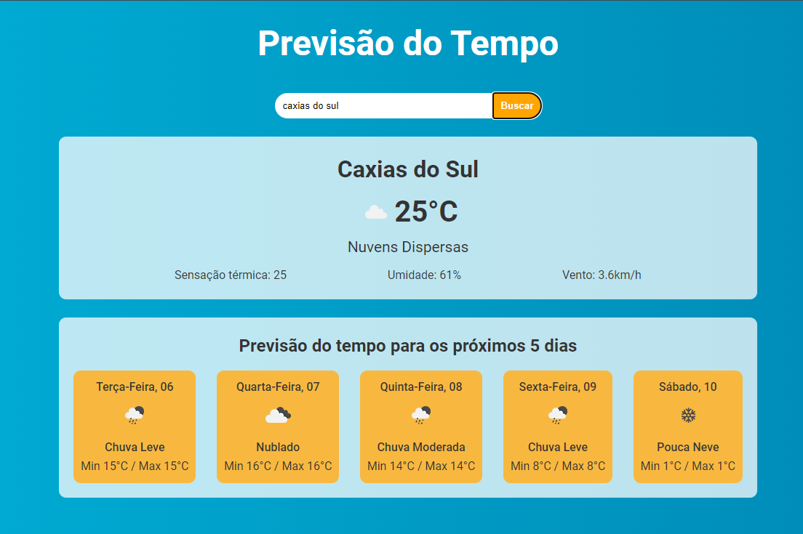

## 📋 Previsão  do Tempo
Projeto pessoal para estudo e melhor compreensão sobre React
## 🧐 Sobre
Esse é um projeto de consulta de previsão do tempo, onde o usuario digita a localização e através de uma requisição de API, obtemos o clima da região solicitada.
## 🤖🛠️ Tecnologias e ferramentas utilizadas
- HTML5
- CSS3
- Javascript
- React
- Node js
- Consumo de API
## 🖼️ Projeto

  

<a href="https://brunosts94.github.io/P/Projetos-React-Portifolio">Visualize o Site aqui

